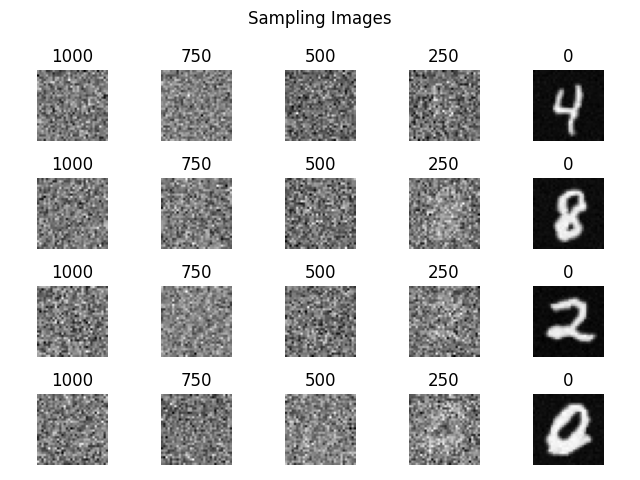

# DDPM
The unofficial Pytorch implementaion of Denoising Diffusion Probabilistic Models (DDPM)



## Updates

## Installation
```
$ git clone https://github.com/jihlim/DDPM.git
$ cd DDPM
$ pip install -r requirements.txt
```

## Train
```
$ cd DDPM
$ python src/train.py
```

## Sampling
```
$ cd DDPM
$ python src/sampling.py
```

## Wandb (Weights & Biases)
- Type `Wandb API key` in `wandb.login()` in `src/uitls/train_utils.py`